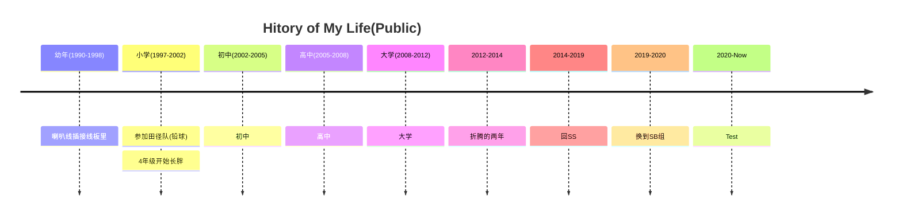
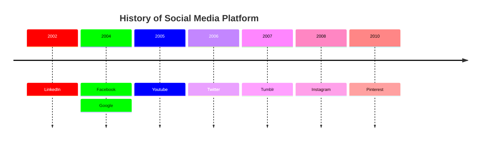
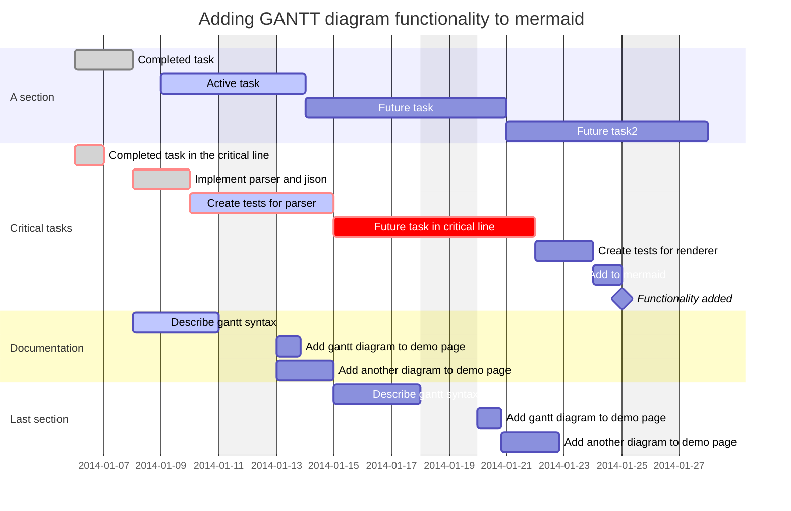
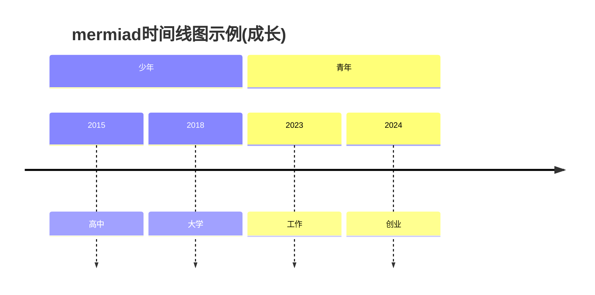
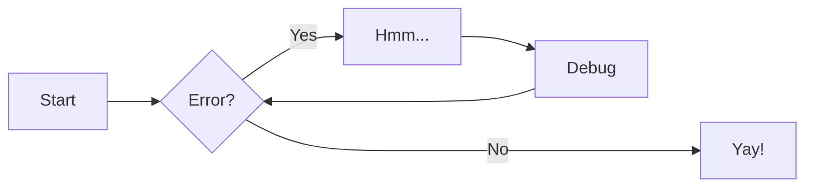
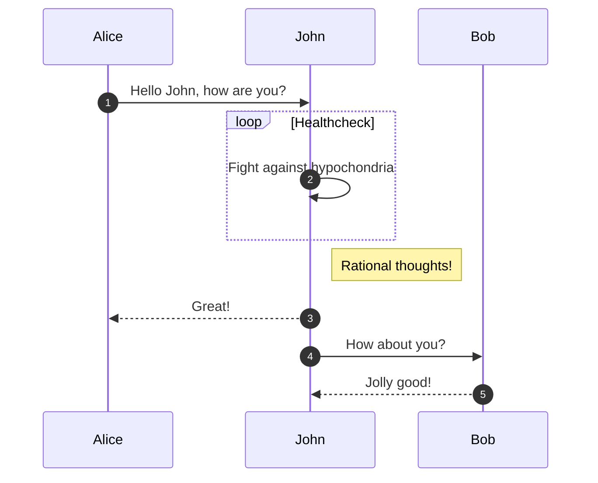

::timeline::

- content: First implementation.
  icon: ':material-rocket-launch-outline:'
  sub_title: 2022-Q1
  title: Launch
- content: Lorem ipsum dolor sit amet, consectetur adipiscing elit.
  icon: ':fontawesome-solid-gem:'
  sub_title: 2022-Q2
  title: New features
- content: Lorem ipsum dolor sit amet.
  icon: ':material-gauge-empty:'
  sub_title: 2022-Q3
  title: More features!
- content: Lorem ipsum dolor sit amet.
  icon: ':material-bug:'
  sub_title: 2022-Q4
  title: Bugs!

::/timeline::

::cards::

- title: Zeus
  content: Lorem ipsum dolor sit amet.
  image: ./img/icons/001-zeus.png

- title: Athena
  content: Lorem ipsum dolor sit amet.
  image: ./img/icons/003-athena.png

- title: Poseidon
  content: Lorem ipsum dolor sit amet.
  image: ./img/icons/007-poseidon.png

- title: Artemis
  content: Lorem ipsum dolor sit amet.
  image: ./img/icons/021-artemis.png

- title: Ares
  content: Lorem ipsum dolor sit amet.
  image: ./img/icons/006-ares.png

- title: Nike
  content: Lorem ipsum dolor sit amet.
  image: ./img/icons/027-nike.png

::/cards::

::gantt::

- title: Definition Phase
  activities:
  - title: Creative Brief
    start: 2022-03-03
    lasts: 1 day
  - title: Graphic Design Research
    start: 2022-03-02
    end: 2022-03-10
    lasts: 2 weeks
  - title: Brainstorming / Mood Boarding
    start: 2022-03-11
    end: 2022-03-20

- title: Creation Phase
  activities:
  - title: Sketching
    start: 2022-03-21
    end: 2022-04-01
  - title: Design Building
    start: 2022-04-02
    end: 2022-04-20
  - title: Refining
    start: 2022-04-21
    end: 2022-04-30

- title: Feedback Phase
  activities:
  - title: Presenting
    start: 2022-04-22
    end: 2022-05-01
  - title: Revisions
    start: 2022-05-02
    end: 2022-05-10

- title: Delivery Phase
  activities:
  - title: Final delivery
    start: 2022-05-11
    end: 2022-05-12

::/gantt::
